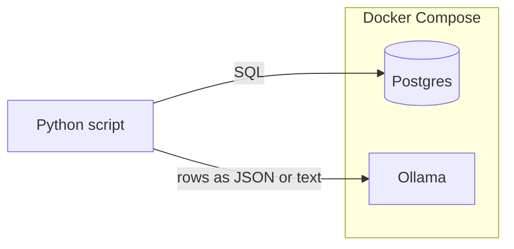

# SQL → Agent pipeline (Postgres + Docker + Ollama)

## Context

The workspace is empty, so this is a **from-scratch** layout. You chose **Ollama** for a small local model (no API keys, slightly heavier images/CPU than a cloud-only stack).

## Architecture

- **Postgres** holds data; an **init SQL** file seeds a minimal table for demos.
- **Python** (single script to start) connects with **psycopg3** (`psycopg[binary]`), runs the query, formats rows (e.g. JSON for readability + size limits), builds a **prompt**, and calls Ollama’s **HTTP API** (e.g. `POST /api/chat` on port `11434` using `httpx`—no need for a heavy orchestration framework for a POC).
- **Ollama** runs a **small** tag such as `llama3.2:1b` or `qwen2.5:0.5b` (you can standardize on one; first run requires a one-time `ollama pull` inside the service).

A single in-process script is the right default: clear data flow, easy to run with `python pipeline.py`, and you can later split into modules or add LangGraph/LangChain only if requirements grow.

## Project layout (proposed)

| Piece | Role |
|--------|------|
| [`docker-compose.yml`](docker-compose.yml) | Services: `postgres` (port `5432`), `ollama` (port `11434`), shared network, named volumes for data + Ollama models |
| [`initdb/01_seed.sql`](initdb/01_seed.sql) | `CREATE TABLE` + `INSERT` sample rows; mounted to Postgres’s `/docker-entrypoint-initdb.d` so it runs once on first start |
| [`requirements.txt`](requirements.txt) | `psycopg[binary]`, `httpx`, `python-dotenv` (optional) |
| [`pipeline.py`](pipeline.py) (or `src/pipeline.py` if you prefer a package) | Config via env: `DATABASE_URL` or `PGHOST`/`PGUSER`/…, `OLLAMA_BASE_URL` default `http://localhost:11434` |
| [`.env.example`](.env.example) | Document `POSTGRES_*` and Ollama URL for copy-paste |
| [`README.md`](README.md) | `docker compose up -d`, one-time model pull, `pip install -r`, run the script |

## Implementation details (concise)

1. **Postgres**  
   - Use official `postgres:16` (or `16-alpine`) with `POSTGRES_USER`, `POSTGRES_PASSWORD`, `POSTGRES_DB` set in compose and mirrored in `.env.example`.  
   - Mount `initdb/` so seed data exists without manual `psql`.

2. **Ollama**  
   - Add official Ollama image, persist models with a volume.  
   - Document **first-time model download** (e.g. `docker compose exec ollama ollama pull llama3.2:1b`)—auto-pull in entrypoint is possible but adds failure modes; README is enough for a POC.

3. **Python pipeline**  
   - Parse query: default embedded SQL and/or `QUERY_FILE` / CLI arg.  
   - **Safety**: for POC, avoid arbitrary SQL from stdin unless you add a read-only role or you explicitly document “trusted queries only.”  
   - **Execution**: `cursor` → `fetchall()` with dict-like rows (`psycopg.rows.dict_row` or `RealDictCursor` pattern in psycopg3).  
   - **Context window**: truncate very large result sets (max rows + max chars) and note truncation in the prompt so the model does not OOM.  
   - **Prompt template**: system line (“You are helping analyze query results…”) + user block containing the SQL and serialized results.  
   - **Ollama call**: `httpx` POST to `/api/chat` with `model`, `messages`, `stream: false` for a simple string response.  
   - **Exit code**: non-zero on DB or HTTP failure.

4. **Why not LangChain / LangGraph for v1?**  
   Fewer moving parts; add them later if you need tools, memory, or multi-step graphs.

5. **Why not a second “worker” container for Python?**  
   For POC, running Python on the host with DB/Ollama in Docker is simplest (same as many tutorials). Optional follow-up: add a small `app` service that includes Python so everything runs in Compose.

## Run sequence (for README)

1. `docker compose up -d`  
2. `docker compose exec ollama ollama pull <small-model>`  
3. `python -m venv .venv && source .venv/bin/activate`  
4. `pip install -r requirements.txt`  
5. `export DATABASE_URL=...` (from compose) and `python pipeline.py`

## Risks / limits (explicit)

- **Ollama** is CPU/GPU heavy; 1B models are light but still need resources.  
- **Large result sets** must be bounded in the script.  
- **Security**: POC assumes trusted SQL; production would use restricted roles, parameterization, and auth.

## Optional next steps (out of initial scope)

- Dockerize the Python runner.  
- Read SQL from a file and add `--limit-rows`.  
- Switch to a cloud API with the same `messages` + HTTP pattern behind an env var.
